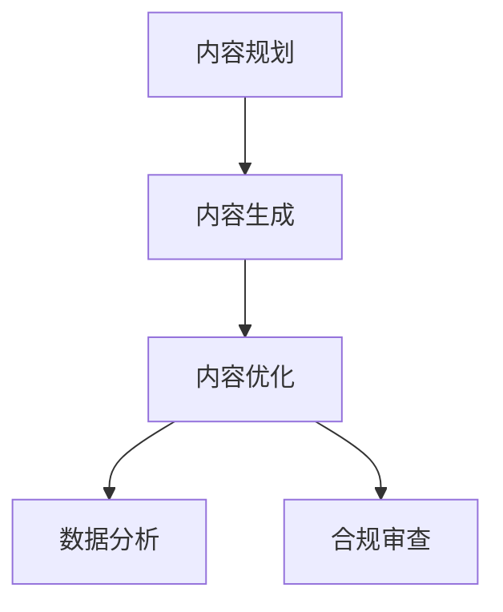

# AI文本职业指南
## 创作流程

---
## 工作内容
| 工作流程 | 工作内容 |
| --- | --- |
| 内容规划 | 分析目标受众需求，制定选题策略（如SEO关键词挖掘、热点追踪） 确定AI生成内容的结构框架与风格调性（如严肃报告/轻松口语化）|
| 内容生成 | 使用Prompt工程驱动AI工具生成初稿（如ChatGPT生成文章大纲） 批量生产多版本内容（如A/B测试用广告标语）|
| 内容优化 | 人工干预修正逻辑漏洞与事实错误 调整语言风格匹配品牌调性（如将AI生成的通用文案转化为特定IP口吻）|
| 数据分析 | 监测内容传播效果（如点击率、转化率） 基于反馈数据迭代Prompt策略（如优化标题生成模板）|
| 合规审查 | 识别AI生成内容的版权风险（如引用数据源合法性） 确保内容符合平台规则与法律法规（如广告禁用词筛查）|

---
## 技术要求
| 技术 | 具体要求 | 工具示例 |
| --- | --- | --- |
| AI工具精通	| 掌握主流文本生成工具特性差异（如Claude长文逻辑强，ChatGPT创意发散性高） 了解模型微调方法（如用LoRA训练行业专属模型） | ChatGPT、Claude、Jasper、Copy.ai |
| Prompt工程 | 设计结构化指令（角色设定+任务描述+输出格式） 掌握进阶技巧（思维链CoT提示、少样本学习Few-shot） | PromptBase（提示词交易平台）、FlowGPT（共享模板库） |
| 数据分析	| 使用BI工具分析内容效果数据 通过A/B测试优化生成策略  | Google Analytics、Hotjar、Airtable|
| 多模态协同	| 文本与其他AI工具的联动（如用AI生成脚本→自动触发视频生成） API接口调用与自动化流程搭建	| Zapier、Make（自动化平台）、Runway API |

---
## 创意要求
| 技能 | 关键能力 |
| --- | --- |
| 差异化创作	| 突破AI内容同质化：通过添加个人经历、独家数据等提升独特性 建立风格标识（如特定句式结构、修辞偏好）|
| 批判性思维	| 识别AI生成内容的逻辑漏洞与事实错误（如虚假数据、过时信息） 判断内容伦理风险（如歧视性表述、文化敏感性）|
| 行业知识沉淀 | 垂直领域术语库建设（如医疗文案需准确使用专业词汇） 积累领域专属语料（如法律文书模板、电商促销话术）|

---
## 商业思维
| 策略 | 应用场景 |
| --- | --- |
| 成本效率评估 | 决策何时使用AI（标准化内容）vs人工（高创意需求内容） 计算ROI（如AI生成千字成本 vs 外包费用）|
| 版权管理 | 选择合规训练数据的模型（如商用授权的BloombergGPT） 处理AI内容的版权归属问题（如平台账号的版权声明模板）|
| 商业模式创新 | 开发AI辅助写作SaaS工具 构建订阅制内容服务（如AI生成行业日报）|

---
## 典型工作流示例
以电商产品详情页文案创作为例，展示AI文本创作者的工作闭环：
- **需求分析**：通过Google Trends确定核心卖点关键词（如"环保材质"）
- **批量生成**：用ChatGPT生成20条标题模板，Jasper生成产品特性描述
- **人工优化**：加入实测数据（"经实验室检测耐磨度提升300%")，调整语气为"亲切导购式"
- **合规审查**：用Originality.ai检测AI内容占比，确保平台要求<50%
- **多模态扩展**：将文案导入Canva生成图文海报，通过HeyGen制作虚拟人讲解视频
- **效果追踪**：分析转化率数据，迭代下一批生成策略
---
## 成长建议
- **初级→中级**：从执行转向策略（如从写单篇文案到设计品牌内容矩阵）
- **中级→专家**：掌握私有化模型部署（如微调行业专属GPT）、主导AI工具选型
---
## 求职建议
- **行业选择**：优先切入高标准化内容领域（如财报摘要、体育快讯），逐步拓展至复杂场景（如创意广告）
