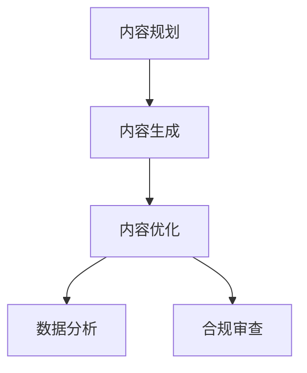

# AI文本创作指南
## 创作流程

## 工作内容
| 工作流程 | 工作内容 |
| --- | --- |
| 内容规划 | ・分析目标受众需求，制定选题策略（如SEO关键词挖掘、热点追踪） ・确定AI生成内容的结构框架与风格调性（如严肃报告/轻松口语化）|
| 内容生成 | ・使用Prompt工程驱动AI工具生成初稿（如ChatGPT生成文章大纲） ・批量生产多版本内容（如A/B测试用广告标语）|
| 内容优化 | ・人工干预修正逻辑漏洞与事实错误 ・调整语言风格匹配品牌调性（如将AI生成的通用文案转化为特定IP口吻）|
| 数据分析 | ・监测内容传播效果（如点击率、转化率） ・基于反馈数据迭代Prompt策略（如优化标题生成模板）|
| 内容优化 | ・识别AI生成内容的版权风险（如引用数据源合法性） ・确保内容符合平台规则与法律法规（如广告禁用词筛查）|
## 技术要求
| 技能维度 |	具体要求	| 工具示例 |
| --- | --- | --- |
| AI工具精通	| ・掌握主流文本生成工具特性差异（如Claude长文逻辑强，ChatGPT创意发散性高） ・了解模型微调方法（如用LoRA训练行业专属模型） | ChatGPT、Claude、Jasper、Copy.ai |
| Prompt工程 | ・设计结构化指令（角色设定+任务描述+输出格式） ・掌握进阶技巧（思维链提示、少样本学习）	| PromptBase（提示词交易平台）、FlowGPT（共享模板库） |
| 数据分析	| ・使用BI工具分析内容效果数据 ・通过A/B测试优化生成策略	| Google Analytics、Hotjar、Airtable |
| 多模态协同	| ・文本与其他AI工具的联动（如用AI生成脚本→自动触发视频生成） ・API接口调用与自动化流程搭建	| Zapier、Make（自动化平台）、Runway API |
